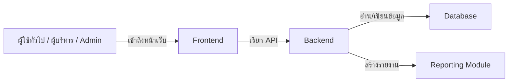

# PrimePC - ระบบจัดการอีคอมเมิร์ซสำหรับรับจ้างหลังบ้าน

## 📋 ข้อมูลทีมงาน (Group Information)

| รหัสนักศึกษา | ชื่อ-สกุล | สาขา |
|---|---|---|
| 1.67140410 | นาย ศรัณยู แซ่ตั้ง | Frontend & Backend |
| 2.67124614 | นาย วรพล เเสงพานิช | Frontend & Backend |
| 3.67137113 | นาย อภิชยุตม์ โรจน์สุกิจ | Frontend & Backend |
| 4.67157971 | นาย ธเนศวร ศรีทับทิม | Frontend & Backend |
| 5.67177222 | นาย ธีระวัฒน์ ซู่ | Frontend & Backend |

**จำนวนสมาชิก:** 5/5 คน

---

## 🎯 ชื่อโครงการ (Project Title)

- **ชื่อภาษาอังกฤษ:** PrimePC - Prime Personal Computer Management System
- **ชื่อภาษาไทย:** ระบบจัดการพีซีหนึ่งเดียว

---

## 💡 เหตุผลและแนวทาง (Rationale)

ในยุคปัจจุบัน การขาดแคลนทรัพยากรคอมพิวเตอร์เป็นปัญหาสำคัญ โดยเฉพาะในสถาบันการศึกษา เพื่อเพิ่มประสิทธิภาพการใช้งานและบริหารจัดการอุปกรณ์ **PrimePC** จึงเป็นแนวทางในการแก้ไขปัญหาดังกล่าว ซึ่งมีความมุ่งหมายเพื่อการบริหารจัดการอุปกรณ์คอมพิวเตอร์ให้มีประสิทธิภาพและตอบสนองความต้องการของผู้ใช้งานได้อย่างแท้จริง

---

## 🎪 วัตถุประสงค์ของโครงการ

นำเสนอแนวทางการแก้ไขอย่างมีประสิทธิภาพสำหรับการบริหารจัดการอุปกรณ์ประเภทพีซี เพื่อให้ระบบสามารถจัดสรรและติดตามการใช้งานอุปกรณ์ได้อย่างเหมาะสม โดยสอดคล้องกับหลักการจัดการทรัพยากรแบบ SDLC

---

## 📊 ขอบเขตของระบบ (System Scope)

### 👥 ผู้ใช้งาน (Customer)

- **สำนักจัดหา และ ผู้บริหาร (Admin):** มีสิทธิ Login และเข้าถึงระบบทั้งหมด
- **ฝ่ายดำเนินการ (IT Department):** สามารถจัดสรรอุปกรณ์และติดตามการใช้งาน
- **ผู้บริหารระดับสูง:** มีสิทธิเพียงดูข้อมูลและสร้างรายงานเท่านั้น
- **ผู้ใช้ทั่วไป:** สามารถดูข้อมูลอุปกรณ์ที่ได้รับมอบหมายและส่งคำขอที่เกี่ยวข้อง
- **ระบบ:** รับการสนับสนุนจากอุปกรณ์หลายประเภท (CPU, GPU, RAM) และการประมวลผลที่สูง

---

## 🔄 แนวทางการพัฒนา SDLC (Brief Description)

| ขั้นตอน | รายละเอียดการดำเนิน |
|---|---|
| **1. Planning** | ศึกษาความเป็นไปได้ของระบบ และการวางแผนสำหรับการจัดทำโครงการ |
| **2. Analysis** | วิเคราะห์ความต้องการของระบบและการกำหนดข้อกำหนดจากผู้ใช้ |
| **3. Design** | ออกแบบโครงสร้างฐานข้อมูล และ UI/UX ด้วย Wireframe |
| **4. Development** | เขียนโค้ดพัฒนาระบบ Frontend และ Backend ตามการออกแบบ |
| **5. Testing** | ทดสอบระบบด้วยวิธี Manual Testing เพื่อค้นหา Bug และข้อบกพร่อง |
| **6. Deployment** | ปรับปรุงและทดสอบระบบบนเซิร์ฟเวอร์จริงก่อนปล่อยให้ใช้งาน |
| **7. Maintenance** | ดำเนินการบำรุงรักษาและปรับปรุงเพิ่มเติมตามข้อเสนอแนะ |

---

## 🛠️ เทคโนโลยีที่ใช้

| เทคโนโลยี | รายละเอียด |
|---|---|
| **Frontend** | React |
| **Backend** | Node.js |
| **Database** | LocalStorage |

---

## ✅ ประเภทการทดสอบ (Test Types)

- 🧪 User Acceptance Testing (UAT)
- 🔧 อุปกรณ์ที่ใช้ (Tools)
- ✍️ Manual Testing

---

## 🎁 ผลลัพธ์ที่คาดว่าจะได้รับ

ระบบจัดการพีซี PrimePC จะสามารถช่วยให้การจัดเก็บข้อมูลและการใช้งานอุปกรณ์มีประสิทธิภาพมากขึ้น โดยผู้ใช้สามารถติดตามสถานะการใช้งานของอุปกรณ์ได้แบบ Real-time พร้อมระบบรายงานที่ครอบคลุม รวมถึงให้ความสะดวกในการบริหารจัดการอุปกรณ์ตามหลักการ SDLC

---

## 📈 แผนการดำเนินงาน 4 สปรินต์ (Work Plan)

| สปรินต์ | รายละเอียด |
|---|---|
| **สปรินต์ 1 (Planning & Design)** | ศึกษาความเป็นไปได้ Use Case, Database Schema, UI Prototype ใน Figma |
| **สปรินต์ 2 (Frontend)** | พัฒนา Interface เฟรมเวิร์ก (ส่วนแสดงผล, ค้นหา, แก้ไขข้อมูล) |
| **สปรินต์ 3 (Backend & Database)** | พัฒนา API, Login, Authorization และ Database Structure |
| **สปรินต์ 4 (Testing & Deployment)** | ทดสอบ Manual ทั้งระบบ และปล่อยให้ใช้งานจริง |

---

## 🧠 Analysis & Design

### แนวคิดการออกแบบ

- จัดเก็บข้อมูลอุปกรณ์พีซีรวมทั้งสถานะการใช้งานและผู้รับผิดชอบ
- แยกส่วน Frontend และ Backend เพื่อให้สามารถพัฒนาและทดสอบได้ง่าย
- ให้ระบบรองรับบทบาทของผู้ใช้งานหลายระดับ (Admin, IT, ผู้ใช้ทั่วไป)
- สร้างรายงานสรุปสถานะอุปกรณ์ด้วยรูปแบบตารางและกราฟ

### โครงสร้างหลักของระบบ

- **Frontend:** หน้าเว็บแสดงผลสำหรับใช้งาน
- **Backend:** API จัดการข้อมูลและรับคำขอ
- **Database:** เก็บข้อมูลอุปกรณ์และการเรียกใช้งาน

## 🏛️ ระบบ Architecture

---

## 🌐 GitHub Pages

### สถานะปัจจุบัน

- มี Git repository อยู่ใน `main` branch
- มีโฟลเดอร์ `docs/` และไฟล์ `docs/index.html`
- มีไฟล์ `docs/.nojekyll` เพื่อให้ Pages ไม่ข้ามไฟล์ที่ขึ้นต้นด้วยจุด

### การตั้งค่า GitHub Pages

1. ไปที่ GitHub repository > Settings > Pages
2. เลือก Source เป็น `main` branch และ folder `docs`
3. กด Save

### URL ที่คาดว่าจะใช้งานได้

- https://gotbangsue.github.io/my-project-documentation/

> หมายเหตุ: หาก GitHub Pages ยังไม่ได้เปิด ใช้งานให้เข้าไปตั้งค่าตามขั้นตอนด้านบน

---

## ✅ เช็คลิสต์ความครบถ้วน

| รายการ | สถานะ | หมายเหตุ |
|---|---|---|
| สร้าง GitHub Repository | ✅ | origin อยู่ที่ `https://github.com/GotBangsue/my-project-documentation.git` |
| มี Commit History | ✅ | มี commit อย่างน้อย 2 ครั้ง |
| README.md ระบุรายละเอียดโครงการ | ✅ | ครบทั้งทีม, วัตถุประสงค์, ขอบเขต, SDLC |
| Analysis & Design | ✅ | เพิ่ม section ใน README และ docs page |
| System Architecture | ✅ | เพิ่ม Mermaid diagram ใน README และ docs page |
| GitHub Pages | ✅ | มี `docs/index.html` และ `docs/.nojekyll` |

---

**สร้างเมื่อ:** 2026-07-02